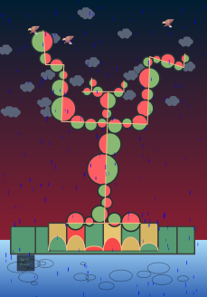
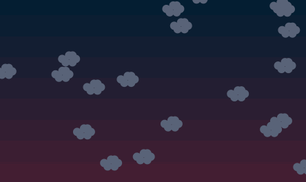
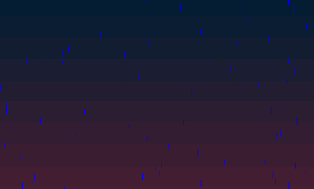
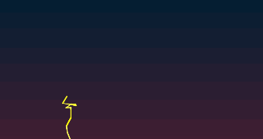
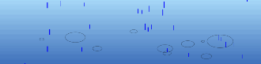
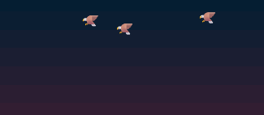

# Tut-10-Group-E-Yishu-Lou-Individual-Task

## Table of Contents
1. [Introduction & How to Interact](#introduction--how-to-interact)
2. [Individual Approach to Animating the Group Code](#individual-approach-to-animating-the-group-code)
    - [Animation Driver](#animation-driver)
    - [Animated Properties and Uniqueness](#animated-properties-and-uniqueness)
    - [Inspiration](#inspiration)
3. [Technical Explanation](#technical-explanation)
    - [Changes to Group Code](#changes-to-group-code)
    - [Individual work and reference](#individual-work-and-reference)

---

## Introduction & How to Interact

**My individual assignment is an animated apple tree in a storm with rain and lightning.** The animation will automatically play when the page is opened, and clicking anywhere on the canvas will play the background music of the thunderstorm.

## Individual Approach to Animating the Group Code
### Animation Driver
I primarily used **Perlin noise and randomness**  to achieve the animation effects.

### Animated Properties and Uniqueness
On the basis of the group work, I added four new animation effects: **moving clouds, falling raindrops, flying birds, striking lightning, and ripples on the water surface**. The raindrops and clouds are encapsulated using Class, and they utilize **Perlin noise** to add randomness to the animation. The lightning and ripples are implemented with **random animations**. The movement of the birds is achieved by **adding randomness to the emoji**. These techniques are not used by other group members.

### Inspiration
The inspiration for this individual assignment came from the video game "Hollow Knight," specifically the City of Tears map, a city where it never stops raining. The rain pours down and forms countless ripples on the ground. I wanted to create a similar rain effect and add elements like lightning and clouds to make the overall picture richer.

## Technical Explanation
### Changes to Group Code
Because many animation effects rely on the continuous refreshing of the background, a visual moving effect is created. In our project, we drew almost all the elements (apples, tree trunks, ground) directly on the canvas within the `draw` function and used `noLoop()` to make it run only once, creating a static scene. This approach interfered with adding other animations, as `noLoop()` prevented them from running. Moving the existing elements to the `setup()` function didn't solve the issue either because it didn't allow for redrawing the background to create a dynamic effect.

After several attempts, Yuchen and I found a solution using the `createGraphics()` method. This method creates an off-screen drawing canvas (graphics buffer) and returns it as a **p5.Graphics object**. It also effectively resolves the problem of overlapping layers between different elements, as we can control the content within the buffer freely.

What's more, our goal in Groupwork is to restore the original art work as realistically as possible, and my personal animation needs to modify the background to make the overall effect more realistic, so I abandoned some elements drawn in Groupwork (mainly background, dot matrix texture generated by external noise). 

After the above operation, I call the buffer region in draw, the effect is shown as follows:

Reference: [createGraphics()](https://p5js.org/reference/#/p5/createGraphics). p5.js reference.

### Individual work and reference
In this section, I'll describe the techniques I use for my animations and how they work one by one.
#### Moving Clouds
I defined a `Cloud` class and an array named `clouds` to store instances of these clouds. Each cloud moves randomly within a specified range using Perlin noise to achieve smooth and natural-looking motion.

In the `Cloud` class constructor, I initialize the cloud's position (`x` and `y`) within a defined range (`x1`, `y1`, `x2`, `y2`). Additionally, two offset values (`xOffset` and `yOffset`) are randomly set and utilized in the Perlin noise function to manage the cloud's movement.

The `move` method updates the cloud's position using Perlin noise to ensure smooth motion. The `map` function translates the Perlin noise values into `x` and `y` movement values. By gradually increasing the noise offsets, the noise values change incrementally over time. Boundary checks are in place to keep the cloud within the specified range, causing it to reappear on the opposite side if it moves beyond the boundaries.

**Performance:**

The cloud drawing method comes from P5's sketch library：
Reference: [P5js Sketches](https://editor.p5js.org/seak/sketches/SJ8gHRzp-)

#### Raindrops
In the `Raindrop` class constructor, I set the initial position (`x` and `y`), `speed`, `len`, and `weight` of each raindrop. The `x` position is randomly assigned within the canvas width, while the `y` position is randomly positioned above the canvas to simulate the falling effect. The `speed`, `len`, and `weight` are also randomized to introduce variety among the raindrops.

The `update` method controls the raindrop's movement. It employs Perlin noise to add a subtle horizontal variation to the raindrop's trajectory by slightly adjusting the `x` position. The `y` position is incremented by the raindrop's speed, producing the falling effect. When a raindrop exits the canvas, its position is reset to the top with a new random `x` position and speed, maintaining a continuous rain effect.

**Performance:**

#### Lightening
The animation effect simulates lightning by drawing a series of connected line segments with random positions, lengths, and colors.

Within a loop, new coordinates are generated by adding random offsets to the previous ones, resulting in a jagged appearance. The `strokeWeight` function sets the segment thickness randomly between 2 and 6, while the `stroke` function selects a random color shade between white and yellow. The `line` function draws the segment from the previous coordinates to the new ones. If the new coordinates exceed the canvas boundaries, the starting point resets to a random horizontal position at the top of the canvas, simulating a new lightning bolt. This function, with its randomized elements, creates a realistic and dynamic lightning effect that can be repeatedly invoked to simulate ongoing lightning strikes.

**Performance:**

The implementation of this animation referenced the P5 sketch:
Reference: [P5js Sketches](https://editor.p5js.org/dlatolley/sketches/Bu3JRNqgF)

#### Ripples
The `updateRipples` function enhances the likelihood of generating ripples by invoking the `createRipple` function with specified coordinates and an initial radius. This function iterates over the `drops` array in reverse order to draw and update each ripple. Utilizing `push` and `pop` to manage transformations, the `ellipse` function renders an elliptical ripple at each drop's position, with the width being twice the height for a realistic appearance. The ripple's radius (`r`) expands by 1 with each frame. If the radius surpasses 25, the drop is removed from the array.

**Performance:**

#### Flying Birds
This code defines a `drawBird` function to position a bird emoji ("🦅") at specified `x` and `y` coordinates, and an `updatePosition` function to animate the movement of three birds. If any bird's horizontal position falls outside the bounds (less than 35 or greater than 864), its corresponding horizontal speed is reversed by multiplying it by -1. Similarly, if any bird's vertical position exceeds the bounds (less than 35 or greater than 450), its vertical speed is reversed. This arrangement ensures that the birds move within the defined canvas area, altering their direction upon reaching the edges to create a dynamic and natural flight pattern.

**Performance:**

